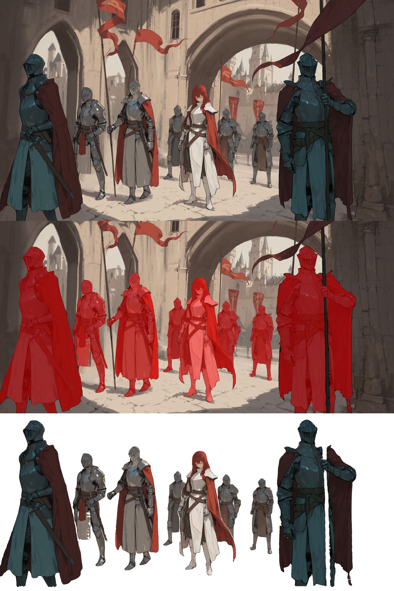

# Krita Lazy Tools

A Krita plugin that adds layer management and automation tools.


## Features
### Color Labeling
- Adds a color label dropdown to Krita's Layer Docker
- Quick assignment of color labels to layers and groups
- Updating a group will not change its children's color labels

### Color Filtering
- Toggle visibility of layers/groups by color label
- Click a color to show/hide all layers with that specific color label

### Script Execution
- Execute custom Python scripts
- Auto-discovery of `.py` files in the `lazy_tools/scripts/` folder
- "Reload Scripts" option for dynamic script development

## Florence-2 + SAM2.1 AI Segmentation

### Key Features

- **Natural Language Prompts**: describe what you want to segment
- **Dual Output Modes**: Red overlay visualization or transparent cutouts
- **Model Selection**: Choose between speed (Base Plus) or quality (Large)
- **Seamless Integration**: Results appear as new Krita layers automatically
- **Real-time Progress**: Live feedback during processing
- **Smart Caching**: Models download once and cache locally

### How to Use

#### In Krita Plugin:
1. **Load an image** in Krita
2. **Open Lazy Tools docker** (Settings → Dockers → Lazy Tools)
3. **Enter a prompt** describing what to segment (e.g., "girl", "car", "building")
4. **Choose SAM2 model**:
5. **Select output type**:
   - **Red Overlay**: Visualize segmented areas with red highlighting
   - **Transparent Cutout**: Create clean cutouts with transparent backgrounds
6. **Click "Run"**

#### Command Line Usage:
```bash
# Basic segmentation
python lazy_segment.py image.jpg "girl"

# High-quality transparent cutout
python lazy_segment.py image.jpg "person with hat" --cutout --model large

# Custom output path
python lazy_segment.py input.jpg "car" output_cutout.png --cutout
```

### Installation & Setup

This implementation is tested on Windows 11 with NVIDIA 50XX series cards.
Python version is 3.12.10.
Compatibility with other environments is not guaranteed.

#### Installation Steps

1. **Create Virtual Environment**:
   ```bash
   cd <path of your pykrita>\lazy_tools
   python -m venv .venv
   ```

2. **Activate Environment**:
   ```bash
   .\.venv\Scripts\activate
   ```

3. **Install Dependencies**:
   ```bash
   pip install -r requirements.txt
   ```

4. **Download SAM2.1 Models**:
   Download the following checkpoints and place them in the `lazy_tools/models/` folder:
   - [`sam2.1_hiera_base_plus.pt`](https://dl.fbaipublicfiles.com/segment_anything_2/092824/sam2.1_hiera_base_plus.pt) (1.1GB)
   - [`sam2.1_hiera_large.pt`](https://dl.fbaipublicfiles.com/segment_anything_2/092824/sam2.1_hiera_large.pt) (2.3GB)

   ```
   lazy_tools/
   ├── models/
   │   ├── sam2.1_hiera_base_plus.pt
   │   ├── sam2.1_hiera_large.pt
   │   └── florence-2-large-ft/ (auto-downloaded)
   ```

### 📊 Example Results


