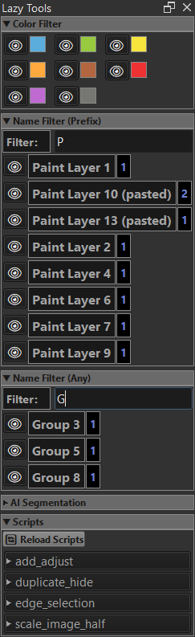

# Krita Lazy Tools

A Krita plugin that adds custom layer management, automation tools and color pick function.



## Support

If you find this tool helpful, you can support its development:

[](https://ko-fi.com/toma_omito)

## Table of Contents
- [Features](#features)
  - [Color Labeling](#color-labeling)
  - [Color Filtering](#color-filtering)
  - [Name Filtering](#name-filtering)
  - [AI Segmentation](#ai-segmentation)
  - [Script Execution](#script-execution)
- [Custom Actions](#custom-actions)
  - [Add New Layer](#add-new-layer)
  - [Rename Layer](#rename-layer)
  - [Duplicate Layer](#duplicate-layer)
  - [Color Pick from Anywhere](#color-pick-from-anywhere)
  - [Disable Top Menu Shortcuts](#disable-top-menu-shortcuts)
  - [Selection Mask Alternative](#selection-mask-alternative)
  - [Selection Mask Popup](#selection-mask-popup)
  - [Deselect Alternative](#deselect-alternative)
  - [Set Foreground Color](#set-foreground-color-1-9)
- [Florence-2 + SAM2.1 AI Segmentation](#florence-2--sam21-ai-segmentation)
  - [Key Features](#key-features)
  - [How to Use](#how-to-use)
  - [Installation & Setup](#installation--setup)

## Features
### Color Labeling
- Adds a color label dropdown to Krita's Layer Docker
- Quick assignment of color labels to layers and groups
- Updating a group will not change its children's color labels

### Color Filtering
- **Visibility Toggle**: Eye icon (👁) to show/hide all layers with that color
- **Quick Actions:**
   - **Shift + Left Click** the color label to set opacity to 10%, 25%, 50%, 75%, or 100%

### Name Filtering
- **Two Matching Modes:**
  - **Prefix Match**: Filter layers that start with the pattern (e.g., "bg_" matches "bg_layer", "bg_sky")
  - **Any Match**: Filter layers containing the pattern anywhere (e.g., "bg" matches "bg_layer", "layer_bg")
- Node list updates automatically every second
- Layers sorted alphabetically regardless of case
- Display the count nodes with same name
- **Quick Actions:**
  - **Left  Click** the name label to activate the first matching node
  - **Ctrl + Right Click** the name label to remove the first matching node
  - **Shift + Left Click** the name label to set opacity to 10%, 25%, 50%, 75%, or 100%
- **Visibility Toggle**: Eye icon (👁) to show/hide all layers with that name

### AI Segmentation
- AI-powered image segmentation using Florence-2 and SAM2.1
- This feature is only available when the `lazy_tools/models` folder exists
- See the [Florence-2 + SAM2.1 AI Segmentation](#florence-2--sam21-ai-segmentation) section below for setup and usage

### Script Execution
- Execute custom Python scripts
- Auto-discovery of `.py` files in the `lazy_tools/scripts/` folder
- "Reload Scripts" option for dynamic script development

## Custom Actions
A collection of scripts to speed up workflow.
- Add New Layer
- Rename Layer
- Duplicate Layer
- Color Pick from Anywhere
- Disable Top Menu Shortcuts
- Folder All Layer Groups
- Exapnd All Layer Groups
- Selection Mask
- Selection Mask Popup
- Deselect
- Set Foreground Color

Go to `Settings > Configure Krita > Keyboard Shortcuts` and search for:
- "Add New Layer Alternative"
- "Rename Alternative"
- "Duplicate Layer Alternative"
- "Expand All Folders"
- "Fold All Folders"
- "Create Selection Mask Alternative"
- "Create Selection Mask Popup"
- "Deselect Alternative"
- "Set Foreground Color 1-9"

### Add New Layer


Opens a dialog to create a new layer with options:

**Layer Types:**
- Paint layer
- Group layer
- Fill layer(Foreground Color)

**Options:**
- **Layer Name** - Editable combo box populated with names from config file. Leave empty to auto-generate (e.g. `Paint-a3f2`, `Group-7b4c`). You can select from predefined names or type a custom name.
- **Blending Mode** - Choose from a list or type your own
- **Add Below** - Creates the layer below the active layer instead of above
- **Add As Child** - If active layer is a group, creates the layer inside that group
- **Inherit Alpha** - Enable alpha inheritance
- **Pass Through** - Enable pass-through mode (for group layers)

### Rename Layer


Quick rename dialog that appears at your mouse cursor position.

**Features:**
- Displays layer names from config file (`lazy_tools/config/name_color_list.txt`)
- Shows color icons next to layer names when color is specified
- Click any name to rename active layer and apply color label
- Manual input section for custom names with color icon dropdown
  - Select color using visual color icons
  - Type custom layer name
  - Optional: Save to config file with "Save" checkbox
- Supports case-insensitive color names: Blue, Green, Yellow, Orange, Brown, Red, Purple, Grey
- Sets color to None/Transparent when no color is specified

**Configuration:**
- Open Settings dialog from Lazy Tools docker (gear icon at bottom)
- Go to "Name List" tab to edit layer names and colors
- Format: `layer_name` or `layer_name, Color`
- Example:
  ```
  sketch
  lineart, Blue
  base_color, Green
  shading, Yellow
  ```

### Duplicate Layer


Duplicates the active layer with options:

**Options:**
- **Layer Name** - Edit the name of the duplicated layer
- **Blending Mode** - Change blending mode (for paint layer)
- **Hide Original** - Hides the original layer after duplicating
- **Add to Group** - Create a new group and move layers into it

### Color Pick from Anywhere

Pick colors from anywhere on your screen (including other apps like PureRef) using a global hotkey.

- Instant color sampling from any application
- Sets the picked color as your foreground color in Krita

**Hotkey:** `Win + Shift + C`

**Platform:** Windows only

**Note:** This feature will only be enabled in Windows OS.

### Disable Top Menu Shortcuts

[Disable the Alt shortcuts on the menu entries.](https://krita-artists.org/t/a-way-to-disable-override-windows-default-alt-menu-command-please/78828/5)

### Selection Mask Alternative
Creates a selection mask and places it into a layer group called `Selection_Mask_Group`.

### Selection Mask Popup


Opens a popup window displaying all masks inside the `Selection_Mask_Group`. Click any mask thumbnail to activate it.

### Deselect Alternative
Deselect and Switch to Freehand Brush Tool in one action.

### Set Foreground Color 1-9

Quickly switch to preset foreground colors.

- 9 customizable color slots available
- Configure colors via Settings dialog (gear icon in Lazy Tools docker)
- Assign keyboard shortcuts in `Settings > Configure Krita > Keyboard Shortcuts`

## Florence-2 + SAM2.1 AI Segmentation

### Key Features

- **Natural Language Prompts**: describe what you want to segment
- **Dual Output Modes**: Red overlay visualization or transparent cutouts
- **Model Selection**: Choose between speed (Base Plus) or quality (Large)
- **Seamless Integration**: Results appear as new Krita layers automatically
- **Real-time Progress**: Live feedback during processing
- **Smart Caching**: Models download once and cache locally

### How to Use

#### In Krita Plugin:
1. **Load an image** in Krita
2. **Open Lazy Tools docker** (Settings → Dockers → Lazy Tools)
3. **Enter a prompt** describing what to segment (e.g., "girl", "car", "building")
4. **Choose SAM2 model**:
5. **Select output type**:
   - **Red Overlay**: Visualize segmented areas with red highlighting
   - **Transparent Cutout**: Create clean cutouts with transparent backgrounds
6. **Click "Run"**

#### Command Line Usage:
```bash
# Basic segmentation
python lazy_segment.py image.jpg "girl"

# High-quality transparent cutout
python lazy_segment.py image.jpg "person with hat" --cutout --model large

# Custom output path
python lazy_segment.py input.jpg "car" output_cutout.png --cutout
```

### Installation & Setup

This implementation is tested on Windows 11 with NVIDIA 50XX series cards.
Python version is 3.12.10.
Compatibility with other environments is not guaranteed.

#### Installation Steps

1. **Create Virtual Environment**:
   ```bash
   cd <path of your pykrita>\lazy_tools
   python -m venv .venv
   ```

2. **Activate Environment**:
   ```bash
   .\.venv\Scripts\activate
   ```

3. **Install Dependencies**:
   ```bash
   pip install -r requirements.txt
   ```

4. **Download SAM2.1 Models**:
   Download the following checkpoints and place them in the `lazy_tools/models/` folder:
   - [`sam2.1_hiera_base_plus.pt`](https://huggingface.co/facebook/sam2.1-hiera-base-plus/tree/main)
   - [`sam2.1_hiera_large.pt`](https://huggingface.co/facebook/sam2.1-hiera-large/tree/main) 

   ```
   lazy_tools/
   ├── models/
   │   ├── sam2.1_hiera_base_plus.pt
   │   ├── sam2.1_hiera_large.pt
   │   └── florence-2-large-ft/ (auto-downloaded)
   ```

5. **Configure Project Path**:
   
   Update the `PROJECT_DIR` variable in `lazy_tools\widgets\__init__.py` to point to your actual installation path.
   PROJECT_DIR = r"C:\Users\YourName\AppData\Roaming\krita\pykrita\lazy_tools"
